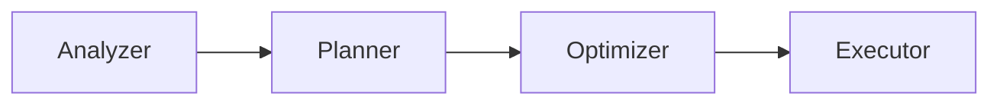

# Presto PR Review Skill

## Overview

This skill guides thorough code reviews for Presto pull requests, following the project's contribution guidelines and best practices.

## Prerequisites

Before proceeding, verify this is a Presto repository:

```bash
# Check for Presto-specific markers
test -f pom.xml && grep -q "com.facebook.presto" pom.xml
```

If this is not a Presto repository, inform the user and do not proceed with this skill.

## How to Invoke

The user will typically:
- Provide a GitHub PR URL (github.com/prestodb/presto)
- Ask to review the current branch
- Point to specific commits to review

## Review Process

### 1. Checkout the PR Code

First, fetch and checkout the PR so the code is available locally for browsing:

```bash
# For a GitHub PR URL, checkout the PR branch
gh pr checkout <pr-number>

# Or if given a branch name
git fetch origin <branch-name>
git checkout <branch-name>
```

This ensures the code is available locally for the user to browse and cross-check during the review.

### 2. Gather Context

First, understand what changed and check for proper process:

**Size and process checks:**
- Large changes (>2000 lines) should have an [RFC](https://github.com/prestodb/rfcs)
- PR should not exceed 5000 lines (excluding generated files)
- Medium changes should have an associated GitHub issue

First, understand what changed:

```bash
# If on a feature branch, compare to master
git diff master..HEAD --stat
git log master..HEAD --oneline

# For a specific commit
git show <commit> --stat
```

### 3. Code Style Checklist

Verify adherence to Presto style guidelines:

- [ ] **Line length**: Aim for 180 characters, but acceptable to exceed if breaking the line would look awkward
- [ ] **Naming**: No abbreviations (use `positionCount` not `positionCnt`)
- [ ] **Static imports**: Using `format()`, `toImmutableList()`, `requireNonNull`, `checkArgument`
- [ ] **Immutability**: Preferring Guava immutable collections (`ImmutableList`, `ImmutableMap`)
- [ ] **Fields**: Declared `final` when possible
- [ ] **Class structure**: Fields before methods, ordered by access level (public -> private)
- [ ] **Nullability**: Using `@Nullable` annotation where appropriate
- [ ] **Validation**: Constructor arguments validated with `requireNonNull` and `checkArgument`

### 4. Code Safety and Quality

**IMPORTANT: Follow existing conventions**

Before accepting new patterns or mechanisms, ask:
- Is there an existing pattern in the codebase that does something similar?
- Can this build on top of existing infrastructure instead of creating something new?
- Why can't the existing approach be extended?

There is a tendency to want to redo everything from scratch. Push back on this - often existing mechanisms can be extended or reused. New abstractions should be a last resort, not a first instinct.

Evaluate changes through three axes:

**Code Quality & Maintainability:**
- Does the code follow existing conventions?
- Is it implemented cleanly with appropriate interfaces?
- Would doing everything this way make the codebase hard to maintain?

**Code Safety:**
- Thread safe?
- No data structures that can grow without bounds?
- Memory usage is accounted for?
- Not introducing expensive calls in performance-sensitive areas?
- Feature flags for risky new features?

**User Friendliness:**
- Config options have understandable names and descriptions?
- New features have documentation?
- Release notes added for user-visible changes?

**Also look for:**
- **Resource management**: Try-with-resources for closeable resources
- **Error handling**: Appropriate exception types, meaningful messages
- **Logging**: Appropriate log levels, no sensitive data logged

### 5. Presto-Specific Concerns

#### For SPI Changes (presto-spi module)
SPI changes require extra scrutiny:
- **No new dependencies**: The SPI must remain dependency-free to avoid forcing connectors to pull in unwanted libraries
- **Keep it generic**: Avoid adding hooks for specific vendor infrastructure or proprietary systems
- **Simplicity over flexibility**: A simple SPI that covers common cases is better than a complex one that handles every edge case
- **Backwards compatibility**: Changes should not break existing connector implementations
- Ask: "Would an open-source connector author find this interface reasonable and understandable?"

#### For Connector Changes
- Does it properly implement the SPI interfaces?
- Are metadata operations efficient (avoid N+1 queries)?
- Is split generation parallelizable?
- Are pushdowns implemented correctly?

#### For Planner/Optimizer Changes
- Are optimization rules correct and complete?
- Do they preserve query semantics?
- Are there potential infinite loops in rule application?
- Is cost estimation impacted?

#### For Execution Changes
- Is memory tracking correct?
- Are operators properly handling yield signals?
- Is data processed in a streaming fashion where possible?
- Are there potential deadlocks in exchange operations?

#### For New HTTP Endpoints
- Follow RESTful conventions (proper use of GET/POST/PUT/DELETE, resource-based URLs)
- Consistent with existing endpoint patterns in the codebase
- Proper error responses and status codes

### 6. Test Coverage

Verify:

- [ ] New code has corresponding tests
- [ ] Bug fixes include regression tests
- [ ] Edge cases are tested
- [ ] Tests are deterministic (no `Thread.sleep`, no random values)
- [ ] Integration tests if behavior changes cross module boundaries

**Avoid test duplication:**
- If multiple new tests cover overlapping scenarios, prefer the most comprehensive one
- Example: If test A covers scenarios X, Y, Z and test B only covers X, Y - just keep test A
- Each test should add distinct value; don't add tests just for coverage numbers

**Require negative test cases:**
- Feature flags: Test that behavior is correct when the feature is disabled
- Access control: Test that denied permissions actually block access (not just that granted permissions work)
- Validation: Test that invalid inputs are properly rejected
- Error paths: Test that failures are handled gracefully, not just the happy path

### 7. Documentation

Documentation is **required** for:
- [ ] **New SPI interfaces or changes**: Update the [Developer Guide](https://prestodb.io/docs/current/develop.html)
- [ ] **New session properties**: Document in connector or relevant module docs
- [ ] **New config properties**: Document with clear descriptions that operators can understand
- [ ] **Release notes**: Required for user-visible changes

Also check:
- [ ] Javadoc where it adds value (complex interfaces, non-obvious behavior) - not required everywhere
- [ ] Comments for complex logic
- [ ] README updates if user-facing behavior changes

### 8. Commit Structure

Presto uses [Conventional Commits](https://www.conventionalcommits.org/). PR titles must follow this format:

```
<type>[(scope)]: <description>
```

**Types:** feat, fix, docs, refactor, perf, test, build, ci, chore, revert, misc

**Common scopes:** parser, analyzer, planner, spi, scheduler, connector, function, operator, native, docs

**Examples:**
- `feat(connector): Add support for dynamic catalog registration`
- `fix: Resolve memory leak in query executor`
- `feat!: Remove deprecated configuration options` (breaking change)

**Verify:**
- [ ] PR title follows conventional commit format
- [ ] Each commit passes tests independently
- [ ] Body explains what and why (not how)
- [ ] Related issues referenced (e.g., `Resolves: #1234`)

## Output Format

**IMPORTANT**: Output the review directly in the conversation for the user to read. Do NOT post comments directly to GitHub - the user will decide what feedback to share.

Always begin your review with: `[review-pr skill]`

Structure your review as:

```markdown
<!-- Reviewed using review-pr skill -->

## High-Level Overview
A brief 2-3 sentence summary of what this change accomplishes at a conceptual level. Focus on the "what" and "why" - what problem does this solve and what is the approach? This should be understandable by someone unfamiliar with the specific code.

## In-Depth Overview
A detailed explanation of the implementation:
- What components/modules are modified and why
- Key classes, interfaces, or methods introduced or changed
- How the pieces fit together
- Any notable design decisions or trade-offs made

## Change Flow Diagram
**Include when applicable** - especially for changes involving:
- Multiple components interacting
- New request/response flows
- Data transformations or pipelines
- State machines or lifecycle changes

Use ASCII diagrams or Mermaid syntax:

```
┌──────────────┐    ┌──────────────┐    ┌──────────────┐
│  Component A │───>│  Component B │───>│  Component C │
└──────────────┘    └──────────────┘    └──────────────┘
```

Or for more complex flows, use Mermaid:



Skip this section for simple changes (single-file bug fixes, documentation updates, minor refactors).

## Summary
Brief overall assessment of the PR quality, readiness for merge, and any high-level concerns.

## Highlights
Things done well in the PR.

## Issues Found

### Critical
Issues that must be fixed before merging.

### Suggestions
Improvements that would make the code better but aren't blocking.

### Nits
Minor style or formatting issues.

## Questions
Clarifications needed from the author.

## Testing Recommendations
Additional tests that should be considered.
```

## Running Checks

```bash
# Check code style
./mvnw checkstyle:check -pl <module-name>

# Compile to catch type errors
./mvnw compile -pl <module-name>

# Run tests
./mvnw test -pl <module-name> -Dtest=<TestClass>
```

## Common Issues to Watch For

1. **Incorrect imports**: `com.facebook.presto.spi.QueryId` vs `com.facebook.presto.execution.QueryId`
2. **Missing null checks**: Especially in connectors handling external data
3. **Unclosed resources**: Iterators, streams, connections
4. **Hardcoded values**: Magic numbers, hardcoded paths
5. **Backwards compatibility**: Breaking changes to public APIs
6. **Security**: SQL injection, command injection, XSS in Web UI
